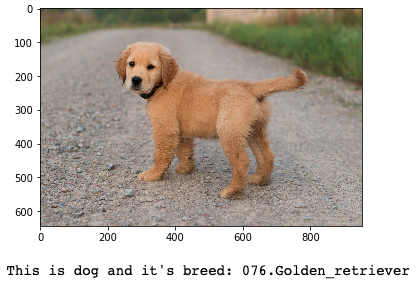
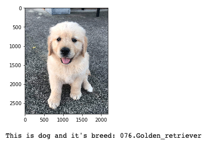
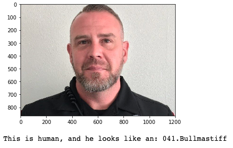

# Dog Breed Classifier Project
This project was completed as part of the course requirements of [Udacity's Data Scientist Nanodegree](https://www.udacity.com/course/data-scientist-nanodegree--nd025) certification.

<li><a href="#Installation">Installation</a></li>
<li><a href="#Project Overview">Project Overview</a></li>
<li><a href="#File Descriptions">File Descriptions</a></li>
<li><a href="#Results">Results</a></li>
<li><a href="#Licensing">Licensing</a></li>

# Installation:
Python version 3
- Libraries:
  - sklearn.
  - keras.
  - glob.
  - random.
  - cv2.
  - tqdm.
  - PIL.
  - extract_bottleneck_features.
  - numpy.
  - matplotlib.

# Project Overview:
In this project, we build a pipeline that can be used within a web or mobile app to process real-world, user-supplied images.  Given an image of a dog, your algorithm will identify an estimate of the canine’s breed.  If supplied an image of a human, the code will identify the resembling dog breed.  

# File Descriptions:

# Results:
The main findings of the code can be found at the post available [here](https://medium.com/@mhnghamdi/dog-identification-app-75f9d92a4990).
Examples of output:

# Licensing:
see this [file](LICENSE.txt) 

